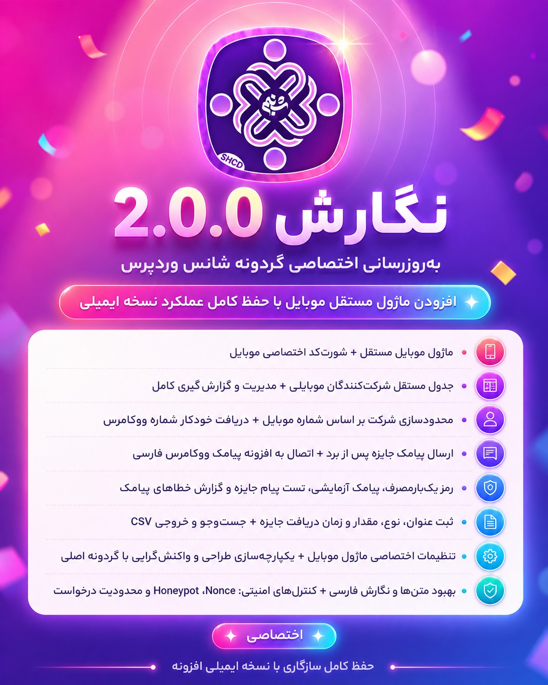
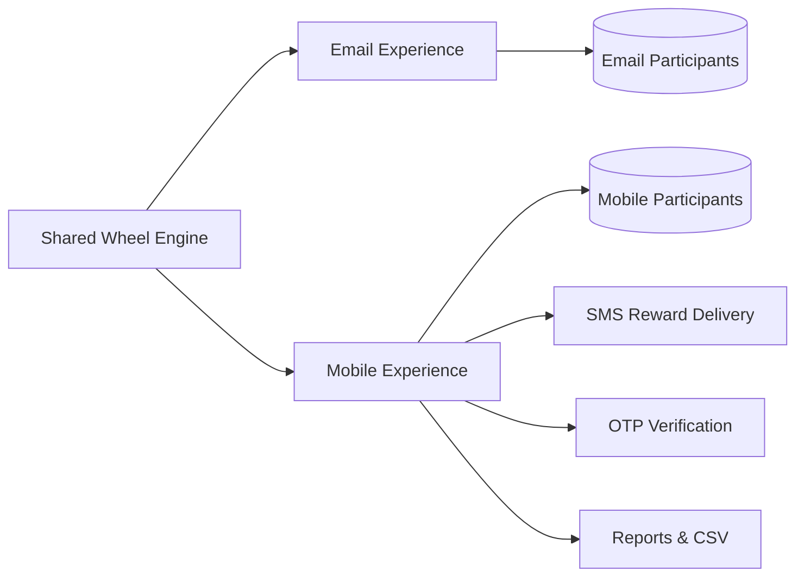
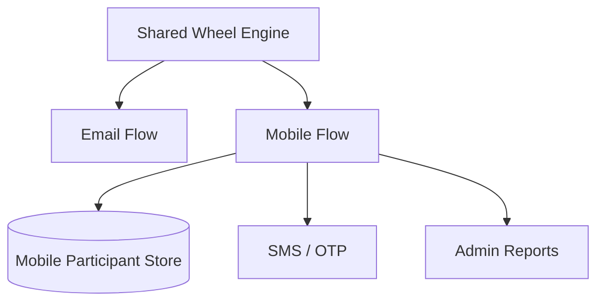

<p align="center">
  
</p>

<h1 align="center">🎡 WordPress Lucky Wheel Pro</h1>

<p align="center">
  <strong>گردونه شانس حرفه‌ای وردپرس و ووکامرس با هویت موبایلی، پیامک جایزه و رمز یک‌بارمصرف</strong>
</p>

<p align="center">
  <a href="#-نگارش-200"></a>
  <a href="https://wordpress.org/"></a>
  <a href="https://www.php.net/"></a>
  <a href="https://woocommerce.com/"></a>
  <a href="https://wordpress.org/plugins/persian-woocommerce-sms/"></a>
</p>

<p align="center">
  <a href="#-معرفی-فارسی">فارسی</a>
  &nbsp;•&nbsp;
  <a href="#-english-overview">English</a>
  &nbsp;•&nbsp;
  <a href="#-شروع-سریع">شروع سریع</a>
  &nbsp;•&nbsp;
  <a href="#-معماری-نسخه-دوم">معماری</a>
</p>

<p align="center">
  
</p>

---

<div dir="rtl" align="right">

## 🇮🇷 معرفی فارسی

**WordPress Lucky Wheel Pro** یک ابزار بازاریابی تعاملی برای وردپرس و ووکامرس است که بازدیدکننده را از یک شرکت‌کننده ساده به یک سرنخ قابل‌پیگیری تبدیل می‌کند.

نگارش **2.0.0** فقط یک به‌روزرسانی ظاهری نیست. این نسخه یک مسیر کامل موبایل‌محور به افزونه اضافه می‌کند: ثبت شرکت‌کننده با شماره موبایل، کنترل دفعات شرکت، تحویل پیامکی جایزه، تأیید شماره با رمز یک‌بارمصرف و مدیریت مستقل مخاطبان موبایلی، در حالی که نسخه ایمیلی قبلی بدون اختلال باقی می‌ماند.

> **نسل دوم افزونه، یک موتور مشترک و دو تجربه مستقل دارد:** مسیر ایمیلی برای کاربران فعلی و مسیر موبایلی برای کمپین‌های فروش و جذب سرنخ در بازار ایران.

</div>

## ⚡ نگارش 2.0.0

```diff
+ ماژول مستقل گردونه با هویت موبایلی
+ شورت‌کد اختصاصی برای تجربه موبایل‌محور
+ جدول مستقل شرکت‌کنندگان، سوابق و جوایز موبایلی
+ ارسال خودکار پیامک جایزه پس از برد
+ رمز یک‌بارمصرف و تأیید شماره موبایل
+ گزارش وضعیت ارسال، خطاهای درگاه و پیامک آزمایشی
+ مدیریت، جست‌وجو و خروجی CSV مخاطبان موبایلی
+ دریافت خودکار شماره صورتحساب ووکامرس
+ Nonce، Honeypot و محدودیت درخواست
= حفظ کامل مسیر، داده‌ها و عملکرد نسخه ایمیلی
```

<div dir="rtl" align="right">

### تغییر بزرگ اول: هویت موبایلی واقعی

نسخه دوم، شماره موبایل را به یک فیلد تزئینی تبدیل نمی‌کند. شماره استانداردشده، مبنای شناسایی شرکت‌کننده، محدودیت دفعات شرکت، ثبت سوابق و تحویل جایزه است.

- پشتیبانی از ارقام فارسی، عربی و انگلیسی
- پذیرش قالب‌های `09`، `98`، `+98` و `0098`
- یکسان‌سازی شماره‌ها برای جلوگیری از ثبت تکراری
- محدودسازی شرکت بر اساس شماره موبایل
- دریافت خودکار `billing_phone` کاربران ووکامرس

### تغییر بزرگ دوم: مسیر مستقل موبایل روی موتور مشترک

هسته انتخاب جایزه، احتمال‌ها، ظاهر گردونه و تنظیمات اصلی مشترک باقی مانده‌اند؛ اما مسیر موبایل، کنترلر، داده‌ها و گزارش مستقل خود را دارد. نتیجه این طراحی، توسعه قابلیت موبایلی بدون شکستن نسخه ایمیلی است.

### تغییر بزرگ سوم: تحویل پیامکی جایزه

پس از برنده‌شدن، اطلاعات جایزه می‌تواند از طریق درگاه تنظیم‌شده در **پیامک ووکامرس فارسی** برای شرکت‌کننده ارسال شود.

- ارسال پیامک جایزه پس از برد
- پیامک آزمایشی مستقیم
- آزمایش متن واقعی جایزه
- ثبت وضعیت موفق، ناموفق یا غیرفعال
- نمایش پاسخ و خطای واقعی درگاه
- استفاده از تنظیمات موجود افزونه پیامک، بدون ثبت دوباره API

### تغییر بزرگ چهارم: رمز یک‌بارمصرف و امنیت

- تأیید شماره با OTP اختیاری
- نگهداری امن Hash رمز به‌جای مقدار خام
- مدت اعتبار و فاصله ارسال مجدد قابل تنظیم
- Nonce اختصاصی برای درخواست‌ها
- Honeypot ضدربات
- محدودیت درخواست و تلاش ناموفق
- اعتبارسنجی قطعی شماره در سمت سرور

### تغییر بزرگ پنجم: پنل مدیریت مخاطبان موبایلی

- فهرست مستقل شرکت‌کنندگان موبایلی
- نمایش شماره، نام، تعداد و آخرین زمان شرکت
- ثبت عنوان، نوع، مقدار و زمان جایزه
- جست‌وجوی سریع در مخاطبان
- خروجی CSV
- نمایش وضعیت تأیید و رضایت تبلیغاتی
- ماسک‌کردن شماره موبایل در مدیریت

</div>

## 🧠 معماری نسخه دوم



<div dir="rtl" align="right">

این معماری سه هدف اصلی دارد:

1. حفظ سازگاری کامل با نسخه ایمیلی موجود
2. جلوگیری از آمیختگی داده‌های ایمیل و موبایل
3. استفاده مشترک از موتور گردونه، جوایز و طراحی اصلی

</div>

## 🚀 شروع سریع

### گردونه موبایلی

```text
[wordpress_lucky_wheel_mobile]
```

### گردونه ایمیلی موجود

```text
[wordpress_lucky_wheel]
```

<div dir="rtl" align="right">

### نصب و راه‌اندازی

1. فایل ZIP افزونه را از بخش افزونه‌های وردپرس بارگذاری و فعال کنید.
2. تنظیمات گردونه، جوایز، احتمال‌ها و طراحی را تکمیل کنید.
3. برای ارسال پیامک و OTP، افزونه **پیامک ووکامرس فارسی** را نصب و درگاه خود را تنظیم کنید.
4. شورت‌کد موبایل را در برگه، نوشته یا صفحه‌ساز قرار دهید.
5. از تب «ماژول موبایل»، ارسال پیامک آزمایشی و متن جایزه را بررسی کنید.

</div>

## 📡 اتصال پیامک

| منبع | لینک واقعی |
|---|---|
| افزونه پیامک ووکامرس فارسی | [wordpress.org/plugins/persian-woocommerce-sms](https://wordpress.org/plugins/persian-woocommerce-sms/) |
| خرید پنل پیامک | [my.shabnam.dev/store/smspbx](https://my.shabnam.dev/store/smspbx) |

<div dir="rtl" align="right">

اطلاعات کاربری، کلید دسترسی و خط ارسال فقط در افزونه پیامک ووکامرس فارسی مدیریت می‌شوند. ماژول گردونه از همان اتصال فعال برای پیامک جایزه و OTP استفاده می‌کند.

</div>

## 🛡️ امنیت و پایداری

| لایه | پیاده‌سازی |
|---|---|
| اعتبار درخواست | WordPress Nonce |
| مقابله با ربات | Honeypot |
| کنترل سوءاستفاده | Rate limiting |
| اعتبارسنجی شماره | Server-side normalization and validation |
| OTP | Hash storage, expiration and retry limits |
| سازگاری | مسیر ایمیلی قبلی بدون تغییر رفتاری |

## 🧩 سازگاری

| نیازمندی | وضعیت |
|---|---|
| WordPress | `5.0+` |
| PHP | `7.0+` |
| WooCommerce | اختیاری، برای دریافت خودکار شماره مشتری |
| Persian WooCommerce SMS | لازم برای پیامک جایزه و OTP |
| RTL / Persian | پشتیبانی کامل |
| Responsive layout | موبایل، تبلت و دسکتاپ |

## 🖼️ دارایی‌های تصویری مخزن

<p align="center">
  
  &nbsp;&nbsp;&nbsp;
  
</p>

```text
.
├── README.md
└── assets/
    └── github/
        ├── brand-logo.png
        ├── plugin-icon.png
        └── release-2.0.0.jpg
```

<div dir="rtl" align="right">

> مسیرهای تصاویر **واقعی و نسبی به مخزن** هستند. برای نمایش صحیح تصاویر در GitHub، فایل `README.md` و پوشه `assets` را با همین ساختار در ریشه مخزن بارگذاری کنید.

</div>

## 📌 خلاصه تغییرات 2.0.0

- ماژول مستقل گردونه با شماره موبایل
- شورت‌کد اختصاصی موبایل
- جدول مستقل شرکت‌کنندگان و جوایز موبایلی
- محدودسازی شرکت بر اساس شماره موبایل
- دریافت خودکار شماره ووکامرس
- ارسال پیامک جایزه و رمز یک‌بارمصرف
- اتصال به پیامک ووکامرس فارسی
- آزمایش پیامک و ثبت خطاهای درگاه
- مدیریت مخاطبان، جست‌وجو و خروجی CSV
- طراحی واکنش‌گرا و هماهنگ با گردونه اصلی
- بهبود نگارش فارسی رابط کاربری
- افزایش کنترل‌های امنیتی
- حفظ کامل عملکرد نسخه ایمیلی

---

## 🇬🇧 English Overview

**WordPress Lucky Wheel Pro 2.0.0** introduces a complete mobile-first acquisition flow for WordPress and WooCommerce while preserving the existing email experience.

This release adds a dedicated mobile identity layer, an independent participant data model, SMS prize delivery, optional OTP verification, mobile participant management, delivery diagnostics and CSV reporting. The mobile and email experiences share the same wheel engine, prize configuration and responsive visual system, but keep their participant workflows separate.

### What makes 2.0.0 a major release?

- A dedicated mobile wheel shortcode
- Mobile number normalization and identity tracking
- Independent mobile participant and prize history
- SMS prize delivery through Persian WooCommerce SMS
- Optional one-time-password verification
- WooCommerce billing phone prefill
- SMS testing and gateway error diagnostics
- Mobile participant search, management and CSV export
- Nonce validation, honeypot protection and request limiting
- Full backward compatibility with the existing email workflow

### Shortcodes

```text
[wordpress_lucky_wheel_mobile]
```

```text
[wordpress_lucky_wheel]
```

### Runtime model



### Requirements

- WordPress 5.0 or newer
- PHP 7.0 or newer
- WooCommerce is optional
- Persian WooCommerce SMS is required for SMS and OTP delivery

### SMS resources

- [Persian WooCommerce SMS on WordPress.org](https://wordpress.org/plugins/persian-woocommerce-sms/)
- [Buy an SMS panel](https://my.shabnam.dev/store/smspbx)

---

## 📄 Distribution

This is a commercial package. Installation, updates, redistribution and resale are governed by the marketplace license and the licenses of bundled third-party components.

<p align="center">
  <strong>Built for high-conversion WordPress campaigns in the Persian market.</strong>
</p>
